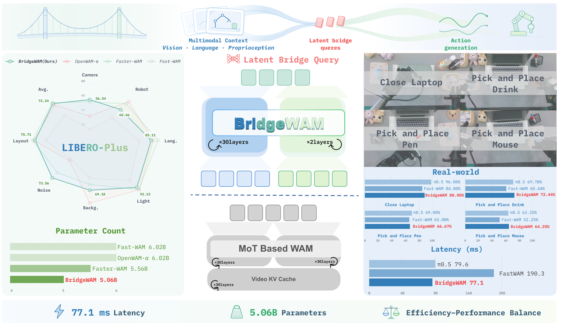

# BridgeWAM

[🤗 Hugging Face Models](https://huggingface.co/BridgeWAM/bridgewam)



BridgeWAM connects pretrained video and action experts through Latent Bridge
Queries (LBQs). This source distribution contains the model implementation,
training and evaluation entrypoints, task configurations, and regression tests.
Datasets, pretrained weights, simulator assets, private experiment records, and
local connection settings are not included.

## Supported model and execution paths

The default model uses 32 Latent Bridge Queries (LBQs), a 30-layer Video DiT and a
two-layer ActionDiT with alternating cross-attention and self-attention blocks.

```text
Training
  scripts/train.py -> runtime.run_training -> BridgeWAMTrainer
  configs/model/bridgewam.yaml -> models/wan22/factory.create_bridgewam
  video + cached text + proprioception + action -> BridgeWAM.training_loss
  Video DiT <-> LBQs -> ActionDiT -> video loss + action loss

Action inference
  observed images + language + proprioception
  -> Video/LBQ prefill once -> fixed LBQ conditioning
  -> iterative ActionDiT denoising -> normalized action chunk
  -> benchmark processor -> physical action -> simulator

Joint video/action inference
  BridgeWAM.infer_joint -> repeated Video/LBQ and Action steps
  -> video decoding + action chunk
```

The main `BridgeOfExperts` class now implements the backbone directly as an
`nn.Module` in `bridge_of_experts.py`. There is no `mot.py` superclass, direct
Video-to-Action K/V path, disabled-LBQ baseline, or separate FastWAM model package.
The underlying Wan numerical components remain shared because BridgeWAM uses them.
The main action-only path does not generate future video. IDM and Joint ablations
have their own explicitly implemented future-video inference paths.

## Source layout

```text
configs/                           Training, data, model and simulation configs
experiments/
  libero/                          Standard LIBERO evaluator and manager
  libero-plus/                     Perturbation evaluator and sharded manager
  libero-pro/                      Pro task manifest, evaluator and manager
  robotwin/bridgewam_policy/        RoboTwin policy adapter
scripts/
  train.py, train_zero1.sh, train_zero2.sh
  precompute_text_embeds.py         Training text cache preparation
  preprocess_action_dit_backbone.py Action backbone initialization
  verify_bridgewam_refactor.py      Pinned-source numerical comparison
  validation/                      CPU regression tests and fixture worker
src/bridgewam/
  runtime.py                       Dataset and training orchestration
  trainer.py                       BridgeWAMTrainer and distributed checkpoints
  models/wan22/
    factory.py                     Main model factory
    bridgewam.py                   Training, inference and checkpoint API
    bridge_of_experts.py            Actual Video/LBQ/Action backbone
    action_dit.py                   Action head
    lbq/                           LBQ tokens and spectral regularization
    ablation_bridgewam/            Four isolated ablation implementations
    checkpoint_compat.py           Weight-name normalization only
    helpers/, schedulers/          Wan loading and flow-matching schedules
    wan_video_*.py                  Shared Video DiT, VAE and text encoder
  datasets/lerobot/
    backend/                       Embedded dataset reader implementation
    processors/, transforms/, utils/
third_party/RoboTwin/               Pinned placeholders; see simulator setup
```

The installable package contains only `src/bridgewam`; existing local datasets,
weights, run artifacts and external environments are not packaged. Model and
dataset components embedded inside `src/bridgewam` retain their original licenses.
Only the supported training, evaluation and validation paths are included;
private research scripts and generated figures are omitted.

## Intentional API changes

This is an API cleanup, not a drop-in replacement for old launcher commands.

| Old entry | Current entry or policy |
|---|---|
| `fastwam.*` imports, `FastWAM*` classes and legacy factories | Removed; use `bridgewam.*` |
| `model=fastwam*`, baseline/standalone Joint and IDM tasks | Removed; use an explicit retained LBQ task |
| `bridgewam.runtime.create_bridgewam` | `bridgewam.models.wan22.factory.create_bridgewam` |
| `mot_checkpoint_mixed_attn` | `checkpoint_attention` |
| `model.mot` as the working interface | `model.bridge`; old storage names remain for weights |
| Standalone `latent_bridge_queries` package | `bridgewam.models.wan22.lbq` |
| `datasets/lerobot/lerobot` | `datasets/lerobot/backend` |
| Standalone Wan model and generic `run_inference` | Removed; use `infer_action` or `infer_joint` |
| `model.infer` and unused `_predict_action_noise` helper | Removed; the trainer calls `infer_joint` directly |
| `FASTWAM_*` launcher variables and old policy adapter | Removed; use `BRIDGEWAM_*` and `bridgewam_policy` |
| Old synthetic MoT profiling script | Removed; use evaluator inference profiling |

An old saved Hydra config must be updated to the current factory and option names.
Use the current task YAML files and supply the previous checkpoint as `resume` or
`ckpt`; do not blindly instantiate a historical `_target_` path.

Unsupported CFG parameters are now rejected: use `text_cfg_scale=1` and an empty
`negative_prompt`. Wan2.2 input encoding requires `tiled=false`. An unimplemented
attention-mode switch and unreachable code after errors were removed. Dataset
backend validation still rejects unsupported data types and invalid episode
indices; these checks are not unfinished training functions.

## Checkpoint contract

The live implementation uses `model.bridge`. To preserve checkpoint keys and
optimizer parameter order, the backbone is still registered as `mot` and `dit`,
and its historical `action_video_kv_layer_mask` buffer is retained. This buffer
has no direct-Video routing implementation behind it. Existing `mixtures.video`,
`mixtures.action` and LBQ tensor keys are unchanged.

`checkpoint_compat.py` still recognizes old weight-wrapper names, including
`fastwam`, and old LBQ metadata spellings. The Frozen Video ablation retains its
historical `video_source` identity string so its verified checkpoints remain
loadable. These are serialized data contracts, not FastWAM model code, imports,
classes, environment-variable aliases or a baseline fallback.

Checkpoint filenames do not need renaming. Weights must match the selected
BridgeWAM topology and ablation identity. The loader continues to reject missing,
conflicting or incompatible parameters and metadata. Loading a two-layer LBQ
checkpoint does not reconstruct a different baseline architecture.

- `resume=/path/to/step.pt`: load model weights and start a fresh optimizer.
- `resume=/path/to/checkpoints/state/step_xxxxxx`: use the existing
  Accelerate/DeepSpeed full-state restore, subject to its original distributed
  topology and metadata requirements.
- `model.load_checkpoint(path, optimizer=optimizer)`: restore compatible model
  weights and a saved optimizer. Small CPU AdamW continuation is regression-tested.

Old full-model Python pickles and old Python import paths are intentionally no
longer supported. Use the project's weight-dictionary checkpoint format.

## Environment and assets

Use the verified Linux/CUDA environment for full training. The package keeps the
pinned training dependencies from the reference version; the package name is
`bridgewam`, and the wheel contains only the `bridgewam` namespace.

```bash
conda create -n bridgewam python=3.10 -y
conda activate bridgewam
pip install -U pip
pip install -e . --extra-index-url https://download.pytorch.org/whl/cu128
export PYTHONPATH="$PWD/src:$PWD${PYTHONPATH:+:$PYTHONPATH}"
export DIFFSYNTH_MODEL_BASE_PATH=/path/to/checkpoints
export DIFFSYNTH_SKIP_DOWNLOAD=true
export BRIDGEWAM_DATA_ROOT=/path/to/data
export BRIDGEWAM_TRAIN_OUTPUT_BASE=/path/to/training-results
```

Provide the matching Wan Video DiT, VAE, tokenizer and optional T5 weights.
`DIFFSYNTH_SKIP_DOWNLOAD=true` requires these files to exist locally. Dataset paths
are relative to `BRIDGEWAM_DATA_ROOT` (default `./data`). Output defaults are local
`runs/` directories instead of hard-coded server locations. Review
`configs/data/*.yaml` for camera layout, action/state dimensions, dataset paths,
normalization statistics and the text cache path.

Before training, prepare the ActionDiT backbone and text embeddings:

```bash
python scripts/preprocess_action_dit_backbone.py \
  --model-config configs/model/bridgewam.yaml \
  --output "$DIFFSYNTH_MODEL_BASE_PATH/ActionDiT_linear_interp_Wan22_alphascale_1024hdim.pt" \
  --device cuda --dtype bfloat16

python scripts/precompute_text_embeds.py \
  task=libero_uncond_2cam224_lbqs_only_2layer_alternating_cross_self_fullfinetune_1e-4 \
  data.train.text_embedding_cache_dir=/path/to/text-cache/libero
```

Existing pretrained ActionDiT backbone files can be reused. The main model's
configured two Action layers retain the original source-layer mapping.

## Training

The `train` configuration defaults to the main LIBERO LBQ task. For eight GPUs:

```bash
CUDA_VISIBLE_DEVICES=0,1,2,3,4,5,6,7 \
  bash scripts/train_zero1.sh 8 \
    task=libero_uncond_2cam224_lbqs_only_2layer_alternating_cross_self_fullfinetune_1e-4 \
    data.train.text_embedding_cache_dir=/path/to/text-cache/libero
```

The launcher uses tmux by default. Set `BRIDGEWAM_TMUX_DISABLED=1` for foreground
execution and `BRIDGEWAM_TMUX_SESSION_NAME` to select a session name. `RUN_ID`,
`NNODES`, `NODE_RANK`, `MASTER_ADDR` and `MASTER_PORT` keep their existing roles.
The launchers and Python training/preprocessing CLIs prepend this checkout's
`src` directory, preventing accidental imports from another installation.

Retained LIBERO tasks are the main task above, its spectral regularization task
`libero_uncond_2cam224_lbqs_spectral_2layer_fullfinetune_1e-4`, and the four tasks in
the [ablation guide](src/bridgewam/models/wan22/ablation_bridgewam/README.md).
`robotwin_bridgewam_3cam384_lbq32_2layer_1e-4` combines the same BridgeWAM LBQ
architecture with the existing RoboTwin data contract. This new RoboTwin task is
structurally checked; no new RoboTwin training result is claimed.

## Simulation evaluation

Install each matching simulator environment separately and provide its resources.
For standard LIBERO:

```bash
export LIBERO_ROOT=/path/to/LIBERO
export BRIDGEWAM_PYTHON="$(command -v python)"
export PYTHONPATH="$PWD/src:$PWD:$LIBERO_ROOT${PYTHONPATH:+:$PYTHONPATH}"

python experiments/libero/run_libero_manager.py \
  task=libero_uncond_2cam224_lbqs_only_2layer_alternating_cross_self_fullfinetune_1e-4 \
  ckpt=/path/to/step.pt \
  EVALUATION.dataset_stats_path=/path/to/dataset_stats.json \
  EVALUATION.output_dir=/path/to/libero-evaluation \
  MULTIRUN.num_gpus=8
```

Use an environment configuration pointing to the matching LIBERO BDDL, initial
states and assets. The managers do not download these resources.

- [LIBERO-Plus](experiments/libero-plus/README.md): pass
  `LIBERO_PLUS.repo_path=/path/to/LIBERO-plus`.
- [LIBERO-Pro](experiments/libero-pro/README.md): set
  `LIBERO_PRO_REPO=/path/to/LIBERO-PRO` or pass `LIBERO_PRO.repo_path`.
- RoboTwin: use `experiments/robotwin/run_robotwin_manager.py`, the new RoboTwin
  task above, and matching checkpoint/statistics files.

**RoboTwin source limitation:** the reference commit contains 1,037 empty regular
files under `third_party/RoboTwin`. This working tree preserves local simulator
files and asset links, replacing only the old policy symlink with a relative
`bridgewam_policy` link. The locally inspected simulator files are also empty. Restore
the verified simulator code and assets before running evaluation. In particular,
the manager requires `third_party/RoboTwin/task_config/_eval_step_limit.yml`;
changing only the worker's `EVALUATION.robotwin_root` does not relocate that file.

For real action-inference timing, use `EVALUATION.profile_inference=true` in the
LIBERO evaluator. This measures the executed model path, including its single LBQ
prefill, instead of constructing an unrelated baseline for profiling.

## Verification

The refactor is checked against the pinned source with tiny CPU models across
main, spectral, Frozen Video, LBQ-K/V, IDM and Joint paths, with gradient
checkpointing both enabled and disabled. The 12 cases compare exact tensor values:
initial/restored weights, loss, gradients, parameter order, action/joint inference,
optimizer updates and continuation from a reference AdamW checkpoint.
VAE encoding/decoding is substituted with fixed latents in that comparison.

```bash
pip install pytest pytest-subtests
PYTHONDONTWRITEBYTECODE=1 PYTHONPATH="$PWD/src:$PWD" \
  python -m pytest -q -p no:cacheprovider tests scripts/validation

python scripts/verify_bridgewam_refactor.py \
  --reference-repo=/path/to/reference-repository \
  --reference-ref=YOUR_REFERENCE_REVISION
```

An additional CPU smoke test executes DataLoader -> real `build_inputs` -> loss ->
Accelerate backward -> optimizer update -> checkpoint save, with synthetic
observations and a tiny VAE stand-in. Trainer logging now handles a missing
DeepSpeed plugin when using ordinary CPU/single-process Accelerate.

The original `tests/` suite is migrated to the canonical BridgeWAM API. Tests for
removed baseline routing, legacy imports and full-model pickle aliases are retired;
LIBERO-Pro tests are consolidated under `scripts/validation`. The suite retains
weight-wrapper/MetaQuery compatibility, strict rejection, optimizer continuation,
spectral gradients and attention-pruning coverage.

The CPU tests also cover every retained model factory, default LBQ configurations,
one prefill per action chunk, explicit unsupported-option errors, historical weight
names, and the LIBERO-Pro manifest/worker/summary interface. This does not establish
full-checkpoint CUDA restoration, multi-GPU training, distributed resume or real
simulator success rates. No pretrained model or simulator assets are bundled.

## Attribution

BridgeWAM builds on the upstream Wan, Fast-WAM and LeRobot components. Original
copyright headers and `LICENSE` are retained. Upstream model/data identifiers and
copyright attribution are not model compatibility interfaces:

- [Upstream model resources](https://huggingface.co/yuanty/fastwam)
- [LIBERO data](https://huggingface.co/datasets/yuanty/LIBERO-fastwam)
- [RoboTwin data](https://huggingface.co/datasets/yuanty/robotwin2.0-fastwam)
